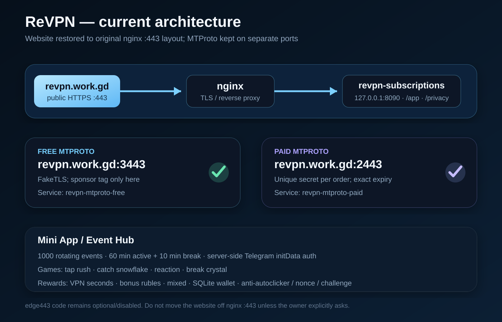
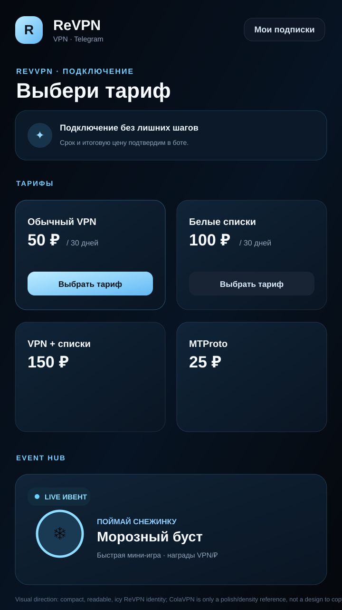

# ReVPN — FULL AI HANDOFF / CONTEXT DUMP

> **Purpose:** this file is meant to be copied whole into another AI so it can continue the ReVPN project without making the owner explain everything again.
>
> **Important:** this is a comprehensive handoff reconstructed from the user-visible ReVPN conversation/work that is available to ChatGPT. It is **not** a byte-for-byte export of every chat message in the app UI, and it intentionally excludes hidden system messages, private chain-of-thought, and credentials/secrets that should not be committed to a public repository.
>
> **Repository:** `ReVerfyx/ReVPN`  
> **Main VPS:** Ubuntu 24.04.4 LTS, public IPv4 `2.26.85.86`  
> **Domain:** `revpn.work.gd`  
> **Repo on VPS:** `~/ReVPN`  
> **Installed app:** `/opt/revpn-shop`  
> **Config:** `/etc/revpn-shop/config.json`  
> **SQLite:** `/var/lib/revpn-shop/shop.sqlite3`

---

## COPY THIS FIRST TO THE NEXT AI

You are taking over an actively developed project called **ReVPN**.

The owner wants **action, not long theory**. When coding, inspect the current `main` branch first, make a branch/PR, run CI/tests, then merge only if green. Do not ask the owner to repeat project context that is already in this file.

Current non-negotiable state:

1. **The website must stay where it originally was:** `revpn.work.gd:443` is owned directly by **nginx**. Do **not** move the website behind the experimental `edge443` unless the owner explicitly asks again.
2. **Paid MTProto and free MTProto stay on separate public ports by default:**
   - paid: `2443`
   - free: `3443`
3. **Do not publish real bot tokens, payment tokens, 3X-UI credentials, keystore passwords, or config secrets to GitHub.**
4. Mini App design should feel **polished like ColaVPN in density/quality**, but **not copy ColaVPN assets/branding/UI 1:1**. ReVPN identity is dark/icy blue.
5. Keep current Event Hub and mini-games. The owner explicitly wants varied events, animations, snowflake catching, and rewards that are not only VPN seconds.
6. Preserve paid MTProto behavior: each paid order gets its own secret and expires independently.
7. The owner prefers concise, direct terminal commands and working code over explanations.

Before changing anything, run/inspect:
```bash
cd ~/ReVPN
git status
git log --oneline -10
```

The normal update command is:
```bash
cd ~/ReVPN &&
git pull --ff-only &&
sudo bash install.sh --update
```

---

## VISUAL REFERENCES

### Current intended server architecture



### Current intended UI direction



These SVGs are in this repository so another AI can understand the target even if it cannot see the original Telegram screenshots.

---

# 1. WHAT ReVPN IS

ReVPN is a Telegram-based VPN/MTProto shop + Mini App running on the user's VPS.

Core pieces:

- Telegram bot shop.
- VLESS delivery through 3X-UI.
- Subscription/Happ pages.
- Paid MTProto proxy product.
- Free sponsored MTProto proxy.
- Mini App at `/app`.
- Privacy page at `/privacy`.
- Event Hub / mini-games.
- Bonus VPN seconds.
- Bonus ruble wallet that discounts later purchases.
- Separate AI-managed Telegram channel/news publisher exists in the repo.

The public Mini App/site domain is:

```text
https://revpn.work.gd
```

Important routes:

```text
https://revpn.work.gd/app
https://revpn.work.gd/privacy
```

---

# 2. CURRENT WEBSITE / NETWORK TOPOLOGY

The owner most recently said:

> "Верни сайт лучше туда где он был изначально"

That has been implemented.

**Current desired/default topology:**

```text
Internet
   |
   | HTTPS :443
   v
revpn.work.gd
   |
   v
 nginx :443
   |
   v
127.0.0.1:8090
revpn-subscriptions
   |
   +-- /app
   +-- /privacy
   +-- /connect/...
   +-- /api/events/...
```

MTProto is **not** supposed to share website port 443 right now:

```text
revpn.work.gd:2443 -> revpn-mtproto-paid
revpn.work.gd:3443 -> revpn-mtproto-free
```

There is experimental code:

```text
edge443.py
edge443_setup.py
revpn-edge443.service
```

but it is now **disabled by default**.

The installer now knows how to restore nginx from local `4443` back to public `443` if edge443 had ever been enabled.

Do not silently re-enable edge443.

---

# 3. WHY EDGE443 WAS TRIED, AND WHY IT WAS ROLLED BACK

The free MTProto proxy had very high Telegram ping from the user's Russian mobile connection.

Observed by the user:

```text
revpn.work.gd:3443 -> ~581 ms in Telegram
another proxy nngo.cc:443 -> ~185 ms
Telegram sometimes showed 500–8000 ms
```

Tests from the VPS to Telegram DCs were much better:

```text
149.154.175.50  -> ~132–152 ms
149.154.167.51  -> ~33–34 ms
149.154.175.100 -> ~136–157 ms
149.154.167.91  -> ~31–33 ms
149.154.171.5   -> ~183–203 ms
```

Middle-proxy port 8888 tests were similar:

```text
DC1 ~131–169 ms
DC2 ~31–35 ms
DC3 ~130–153 ms
DC4 ~30–38 ms
DC5 ~188–194 ms / occasional error
```

This suggested much of the extreme delay was on the user/mobile-network -> VPS path, not CPU load on the VPS.

An experiment was built to share TCP 443 between:

- nginx HTTPS
- free MTProto
- paid MTProto

using SNI routing.

On the actual VPS the install hit:

```text
TCP 443 is still occupied after nginx migration; restored backups
```

The owner then asked to return the site to its original place. That is now the expected state.

---

# 4. DNS / HTTPS HISTORY

Domain:

```text
revpn.work.gd -> 2.26.85.86
```

Confirmed on VPS with:

```bash
getent hosts revpn.work.gd
```

and it returned `2.26.85.86`.

HTTPS certificate was valid Let's Encrypt.

A check with:

```bash
curl -Iv https://revpn.work.gd/app
```

returned:

```text
HTTP/1.1 501 Unsupported method ('HEAD')
```

This was not a TLS failure. `curl -I` sends HEAD and the simple app server did not implement HEAD. A normal GET is the correct health check.

Use:

```bash
curl -sS -o /dev/null -w '%{http_code}\n' https://revpn.work.gd/app
```

Expected normal result: `200`.

---

# 5. BOTFATHER / MINI APP SETTINGS

The user configured Telegram Mini Apps in BotFather.

Correct values:

```text
Main App:
https://revpn.work.gd/app

Menu Button:
https://revpn.work.gd/app
Label: ReVPN
```

Launch mode can be Fullscreen.

Same-Origin Restriction being enabled is okay.

The user had already pressed Save; do not repeatedly tell them to press Save.

The earlier `ERR_NAME_NOT_RESOLVED` screenshot was a DNS/WebView problem, not evidence that the BotFather URL itself was wrong.

---

# 6. MINI APP DESIGN — WHAT THE OWNER WANTS

The owner repeatedly showed ColaVPN screenshots and said things like:

> "Сделай как у кола впн - красивые анимированные значки, анимированная загрузка. Так же доступные красивые ивенты - красиво."

and later:

> "Сравни косой интерфейс и анимации? ... Мне не нравится раскраска и пропавший текст. у кола впн лучше"

Interpretation:

- Use ColaVPN only as a **quality/density/polish reference**.
- Do not copy ColaVPN logo/assets/branding 1:1.
- ReVPN should be its own icy/dark identity.
- Mobile-first.
- Compact like a real product screen, not a giant landing page.
- Tariff cards should be dense, legible and easy to tap.
- Animations should look intentional, not decorative clutter.
- Event UI should feel like a game/event hub, not a debug panel.

A major UI bug happened because CSS used:

```css
color: var(--tg-theme-text-color, ...)
```

Telegram on the user's phone was in light theme and passed a dark text color. That caused **black/dark text on a dark Mini App background**.

This was fixed by forcing ReVPN's branded dark UI to use explicit light text.

Recent UI direction:

- dark near-black background
- icy blue accents
- white high-contrast typography
- pricing first
- 2×2 tariff cards on phone
- compact Event Hub
- animated launch screen
- animated SVG tariff/game icons
- reduced-motion accessibility support

Do not reintroduce Telegram theme text color as the main branded text color.

---

# 7. MINI APP LOADER / ANIMATIONS

The Mini App includes an animated ReVPN launch screen:

- ReVPN logo/core.
- Floating cube/ice motifs.
- Progress track.
- Dark/ice styling.
- Loader disappears after event state is loaded.

There are animated SVG/icon effects for plans/events.

The owner wants a polished launch animation comparable in quality to ColaVPN's loading screen, while staying ReVPN-themed.

---

# 8. EVENT HUB — CURRENT GAME MODES

The owner explicitly requested:

> "Сделай разнообразные ивенты и мини игры. Не все на секунды - Некоторые на бонусные рубли и т.д..."

and:

> "Так же добавь качественные - поймай снежмнку - падают снежинки очень быстро и надо ловить их. Качественно - реальные картинки и анимации"

Current event engine has **1000 rotating event definitions**.

Timing:

```text
60 minutes active
10 minutes break
cycle = 70 minutes
```

Game modes implemented:

### 1. Tap Rush / Тап-гонка
A moving button/target. Server-side nonce and anti-autoclicker remain authoritative.

### 2. Snow Catch / Поймай снежинку
Animated vector snowflakes fall quickly down the event arena. User taps the snowflake before it reaches the bottom.

This intentionally uses vector graphics rather than relying only on emoji.

### 3. Reaction / Ледяная реакция
User waits for a signal/green flash. Early clicks are rejected.

### 4. Ice Break / Разбей кристалл
Animated ice crystal / hit effect / crack progress.

Event client is visual only; server decides rewards.

---

# 9. EVENT REWARDS

Rewards are no longer only VPN seconds.

Current reward categories:

```text
seconds
rubles
mixed
```

Examples:

- +1 VPN second.
- +0.05 ₽.
- +1 second +0.02 ₽.

Server caps exist per event to prevent unlimited reward farming.

The ruble balance is stored in SQLite in **kopecks**, not floating point.

---

# 10. BONUS RUBLE WALLET

The event system can credit a user's bonus wallet.

Database field:

```text
users.bonus_kopecks
```

When creating a new quote, the store reserves available bonus money and reduces the payable amount.

The minimum real payment remains at least **1 ₽** so the payment provider is not asked to create a zero-value invoice.

Expected checkout style:

```text
Цена:       50 ₽
Бонус:      -7.35 ₽
К оплате:   42.65 ₽
```

If a quote is abandoned/stale, reserved bonus funds are released back to the user.

Do not replace integer kopecks with float rubles.

---

# 11. VPN SECOND REWARDS

For VPN-second events:

- seconds accumulate server-side
- first activation requires at least 30 seconds
- a separate reusable bonus VPN order/profile is used
- later claims extend that same bonus profile
- do not create a new VLESS client for every tap

The event bonus order is excluded from normal purchase lists where appropriate so it does not pollute paid order UI.

---

# 12. EVENT AUTH / ANTI-AUTOCLICKER

Mini App uses Telegram `initData` verification on the server.

Important protections implemented:

- Telegram WebAppData HMAC verification.
- Max auth age ~24 hours.
- One-time rotating nonce.
- Minimum tap interval.
- 1-second rate window.
- strike counter.
- temporary cooldown.
- repeated perfectly uniform rhythm detection.
- periodic symbol challenge.
- server-side event ID/time validation.
- reward caps server-side.

Do not trust client-side counters.

Changing JavaScript must not become sufficient to mint rewards.

---

# 13. MTProto — FREE PROXY

Current intended public free proxy port:

```text
3443
```

Service:

```text
revpn-mtproto-free
```

The free proxy uses one common secret and may have a sponsor/ad tag from Telegram's MTProxy bot.

The owner previously registered the free proxy with @MTProxyBot.

**Do not commit the actual secret into this public repository.**

To read the current values directly on the VPS:

```bash
sudo python3 - <<'PY'
import json
c=json.load(open('/etc/revpn-shop/config.json'))
m=c['mtproto']['free']
print("host:", c['mtproto']['public_host'])
print("port:", m.get('public_port',m['port']))
print("secret:", m['secret'])
print("ad_tag:", m.get('ad_tag',''))
print("transport:", m.get('transport'))
print("tls_domain:", m.get('tls_domain'))
PY
```

Base secret sent to @MTProxyBot should be the base 32 hex, not a client-side `dd` or `ee` wrapped secret.

The user previously used random-padding `dd...`, then moved the client links toward FakeTLS `ee...`.

Current code supports FakeTLS.

The user wants the free proxy to work reliably in restricted networks, but **the website must remain on nginx 443 now**.

---

# 14. MTProto — PAID PRODUCT

Paid MTProto is a product in the bot.

Current intended public port:

```text
2443
```

Service:

```text
revpn-mtproto-paid
```

Important behavior:

- each paid order gets its own unique 32-hex secret
- even the same user buying again gets a new secret/order
- orders can be 1 hour / multiple hours / days according to product flow
- expiry is exact
- once a secret expires it is removed from the active user map
- the MTProto upstream is restarted/reloaded so established sessions with expired secrets are cut off
- sponsor tag is for free proxy only, not paid

There are tests for unique secrets and exact 1-hour expiry.

Do not collapse paid users into one shared paid secret.

---

# 15. MTProto CLIENT LINK FORMAT

`delivery.py` builds proxy links.

For FakeTLS, client secret format is conceptually:

```text
ee + base_secret + hex(SNI)
```

For legacy random padding:

```text
dd + base_secret
```

The user-facing hostname is normally `revpn.work.gd`.

Current default public ports after website restore:

```text
paid public_port = 2443
free public_port = 3443
```

---

# 16. CHANNEL AI / NEWS BOT

The user said:

> "А у меня там канал ии ведёт"

ReVPN repo also contains channel publishing code, including:

```text
channel_agent.py
channel_news.py
```

There is/was a systemd service/workflow around:

```text
revpn-channel
```

Useful commands historically shown by installer:

```bash
sudo revpn-channel configure
sudo revpn-channel preview
sudo systemctl enable --now revpn-channel
```

Earlier work fixed a `fetch_articles` import issue.

Urgent-news selection was changed away from a tiny hard-coded keyword list toward model scoring across connected RSS/news candidates.

This subsystem is separate from Mini App events. Do not delete it while redesigning the Mini App.

---

# 17. PRIVACY POLICY

Privacy page:

```text
https://revpn.work.gd/privacy
```

The policy currently describes:

- Telegram ID/display name.
- orders/invoices.
- VPN/proxy keys.
- Mini App initData verification.
- event score/progress.
- accumulated/activated VPN seconds.
- bonus ruble balance.
- anti-autoclicker technical counters.
- server/hosting technical logs.
- deletion requests through support.

The Mini App/footer must keep a visible **"Политика конфиденциальности"** link.

---

# 18. REPOSITORY FILE MAP

Important files:

```text
bot.py
  Telegram bot UI / checkout / menus / admin actions.

core.py
  SQLite schema, Store, orders, quotes, pricing logic, bonus wallet.

providers.py
  3X-UI / Telegram / payment provider integrations.

delivery.py
  Product delivery, VLESS/subscription links, MTProto links.

subscriptions.py
  Public website, Mini App HTML/CSS/JS, privacy page, event HTTP API.

events.py
  Event engine, auth, games, rewards, anti-autoclicker.

mtproto_service.py
  Paid/free MTProto supervisors and expiry handling.

vendor/mtprotoproxy.py
  Vendored MTProto implementation.

install.sh
  Installation/update/systemd units.

setup.py
  Initial setup and config migrations.

edge443.py
edge443_setup.py
  Experimental shared-443 SNI edge. Keep disabled unless explicitly wanted.

channel_agent.py
channel_news.py
  AI/news channel publisher.

tests/
  Unit tests and regression tests.
```

---

# 19. SYSTEMD SERVICES

Main services include:

```text
revpn-shop
revpn-subscriptions
revpn-mtproto-paid
revpn-mtproto-free
revpn-edge443        # expected disabled in current topology
revpn-channel        # optional channel publisher
```

Useful status command:

```bash
sudo systemctl status   revpn-shop   revpn-subscriptions   revpn-mtproto-paid   revpn-mtproto-free   nginx   --no-pager
```

Expected port check:

```bash
sudo ss -ltnp | grep -E ':(443|4443|2443|3443|8090)\b'
```

Desired current topology:

```text
:443  -> nginx
:8090 -> revpn-subscriptions (local/backend)
:2443 -> paid MTProto
:3443 -> free MTProto
:4443 -> not needed in normal mode
```

---

# 20. INSTALL / UPDATE WORKFLOW

Normal update:

```bash
cd ~/ReVPN &&
git pull --ff-only &&
sudo bash install.sh --update
```

The installer:

- compiles/checks Python before stopping the bot
- reuses existing config/database
- copies application files to `/opt/revpn-shop`
- creates/updates systemd units
- restarts core services
- now restores nginx to public 443 when edge443 is disabled

Do not manually overwrite `/etc/revpn-shop/config.json` from `config.example.json`.

---

# 21. TESTING / CI

GitHub Actions workflow:

```text
.github/workflows/tests.yml
```

It runs:

```bash
python -m compileall -q .
python -m unittest discover -s tests -v
bash -n install.sh
```

Recent large feature PR had **103 tests** passing.

The UI contrast fix PR passed CI.

The nginx-443 restore PR passed CI.

Continue using PR + CI before merge.

---

# 22. IMPORTANT RECENT PR / CHANGE HISTORY

Useful recent milestones:

### PR #1 — Mini App VPN reward events
Added the first server-side event engine, Telegram initData auth, 1000 event variants, +1 sec rewards, reusable bonus VPN expiry sync, privacy updates and tests.

Main merge at the time included commit:

```text
bf826c8f866636cebf69bdfec4acb662310aaf01
```

### PR #2 — paid MTProto exact expiry
Kept unique secret per paid order and tightened expiry/restart behavior.

### PR #3 — free MTProto FakeTLS
Moved free link toward FakeTLS and kept old secure/random-padding support as fallback.

### PR #4 — premium Mini App UI
Animated loader, tariff icons, premium cards, Event Hub, live/upcoming event previews.

The user's VPS log later showed main around:

```text
c72b713
```

before the next large event/edge update.

### PR #5 — shared 443 + games/rewards experiment
Added:
- experimental edge443
- 4 mini-game types
- seconds/ruble/mixed rewards
- bonus wallet
- snowflake vector game
- reaction/crystal game

Merge commit:

```text
a93deee43892ef48fb5529377f94872a5124b355
```

### PR #6 — UI contrast / install fallback
Fixed dark-on-dark text from Telegram theme variables, compacted tariffs to 2×2, made install continue on 443 conflict.

Merge:

```text
1e10e7baf33015d568e195477e636cdf3467549f
```

### PR #7 — restore website to original nginx 443
Owner explicitly asked to put the site back.

Merge:

```text
c9edd8d64515033fb357f488034cf36a02080c3a
```

After that, these handoff SVGs were added.

---

# 23. WHAT HAPPENED ON THE VPS DURING THE FAILED 443 MIGRATION

The owner ran:

```bash
cd ~/ReVPN &&
git pull --ff-only &&
sudo bash install.sh --update
```

The update fetched the large shared-443/game change, then printed:

```text
Настройки обновлены: MTProto переведён на FakeTLS/443 через ReVPN edge.
nginx: the configuration file /etc/nginx/nginx.conf syntax is ok
nginx: configuration file /etc/nginx/nginx.conf test is successful
TCP 443 is still occupied after nginx migration; restored backups
```

Because install.sh used `set -e`, installation stopped there.

That meant files could be copied while services were not fully restarted, producing a confusing mixture of old running UI + newer files.

This is why the UI screenshots after that update should not be treated as proof that the latest fixed code was fully deployed.

The current installer logic was changed so this scenario does not leave the site half-migrated.

---

# 24. EXACT UI PROBLEMS THE OWNER COMPLAINED ABOUT

From screenshots:

- some tariff titles/prices looked almost black and disappeared
- giant tall plan cards made scrolling feel bad
- Event Hub was oversized/heavy
- overall layout looked "косой"
- owner thought ColaVPN looked more coherent

The root cause for missing text was not just visual taste; it was the Telegram theme CSS variable.

Target correction:

- explicit white/light text
- 2×2 mobile tariff grid
- lower card heights
- smaller/cleaner hero
- pricing appears quickly
- Event Hub remains below pricing
- icy blue ReVPN theme
- animations remain

---

# 25. USER'S KEY DIRECTIVES — VERBATIM EXCERPTS

These exact-style quotes are useful for understanding intent.

### Mini App polish
> "Сделай как у кола впн - красивые анимированные значки, анимированная загрузка. Так же доступные красивые ивенты - красиво."

### More ambitious events
> "443 для бесплатного прокси + сохранить сайт на том же домене + трогать платные MTProto чтобы они тоже работали нормально . Сделай разнообразные ивенты и мини игры. Не все на секунды - Некоторые на бонусные рубли и т.д... Так же добавь качественные - поймай снежмнку - падают снежинки очень быстро и надо ловить их. Качественно - реальные картинки и анимации"

### MTProto latency
> "Пинг в тг - 500-8000 . Кстати тг заблокирован в рф, но мтпрото должен обходить баны."

### Paid proxy expiry
> "Сделай чтобы ц меня же есть прокси по 1 час и т.д. сделай новый для каждого и по истечению 1 часа он обрубается"

### UI complaint
> "Сравни косой интерфейс и анимации? ... Мне не нравится раскраска и пропавший текст.у кола впн лучше"

### Final website topology choice
> "Верни сайт лучше туда где он был изначально"

That last instruction overrides the shared-443 website experiment.

---

# 26. USER PREFERENCES FOR HOW TO WORK

For this project:

- Russian.
- Direct.
- Fewer words, more action.
- Commands should be easy to paste.
- User frequently works from phone/Termius.
- Do not make them re-explain server basics.
- If code is requested, prefer actually editing repo and merging tested changes rather than dumping long theoretical snippets.
- Tell them exactly what command to run after merge.

---

# 27. SECURITY / SECRETS

This GitHub repository is public.

Never commit values from:

```text
/etc/revpn-shop/config.json
```

that contain:

- Telegram bot token
- payment/LZT token
- merchant secrets
- 3X-UI passwords/tokens
- MTProto private secret if it is not intentionally public
- keystore passwords
- any other credentials

If another AI needs a value, instruct the user to read it locally from the VPS.

Example for free MTProto config:

```bash
sudo python3 - <<'PY'
import json
c=json.load(open('/etc/revpn-shop/config.json'))
m=c['mtproto']['free']
for k in ('port','public_port','transport','tls_domain','ad_tag'):
    print(k, m.get(k))
print('secret: [read locally; do not commit]')
PY
```

---

# 28. ANDROID / CLIENT CONTEXT THAT MAY MATTER

The owner's main phone is Android (realme C71, Android 16).

Telegram screenshots were taken on mobile.

UI must be tested at narrow phone widths.

The owner sometimes uses alternative Telegram clients (a screenshot showed exteraGram), so avoid assuming only one Telegram UI shell.

---

# 29. OTHER ReVPN HISTORICAL CONTEXT

Earlier ReVPN work included:

- VLESS/Xray.
- 3X-UI.
- glass/animated theme ideas.
- multiple profiles/nodes.
- whitelist-related product ideas.
- embedded configs.
- server selection.
- no-debug release client ideas.
- masks/whitelist discussion for Russian networks.

Some older architecture ideas may no longer match current code. Always inspect `main` rather than blindly reviving old assumptions.

---

# 30. SERVER PATHS / COMMANDS QUICK REFERENCE

### Repository
```bash
cd ~/ReVPN
```

### Update
```bash
git pull --ff-only
sudo bash install.sh --update
```

### Shop logs
```bash
journalctl -u revpn-shop -n 100 --no-pager
```

### Mini App/subscription logs
```bash
journalctl -u revpn-subscriptions -n 100 --no-pager
```

### Free MTProto logs
```bash
journalctl -u revpn-mtproto-free -n 100 --no-pager
```

### Paid MTProto logs
```bash
journalctl -u revpn-mtproto-paid -n 100 --no-pager
```

### nginx
```bash
nginx -t
systemctl status nginx --no-pager
```

### ports
```bash
ss -ltnp | grep -E ':(443|8090|2443|3443|4443)\b'
```

### public site health
```bash
curl -sS -o /dev/null -w '%{http_code}\n' https://revpn.work.gd/app
curl -sS -o /dev/null -w '%{http_code}\n' https://revpn.work.gd/privacy
```

---

# 31. WHAT THE NEXT AI SHOULD DO FIRST

If taking over immediately:

1. Inspect latest `main`.
2. Have user update VPS with:
   ```bash
   cd ~/ReVPN &&
   git pull --ff-only &&
   sudo bash install.sh --update
   ```
3. Verify:
   ```bash
   sudo ss -ltnp | grep -E ':(443|4443|2443|3443|8090)\b'
   ```
4. Confirm `:443` is nginx and `:4443` is no longer the website path.
5. Open `https://revpn.work.gd/app` in Telegram and inspect the current UI after the contrast fix.
6. If the owner still dislikes the design, tune spacing/colors/components without changing backend reward logic.
7. Do not reintroduce shared website/MTProto 443 without explicit permission.
8. If working on MTProto performance, optimize on separate ports or use a separate proxy host/server rather than silently moving the site again.

---

# 32. ACCEPTANCE CRITERIA FOR CURRENT PROJECT STATE

A good current deployment should satisfy all of these:

- `https://revpn.work.gd/app` opens.
- `https://revpn.work.gd/privacy` opens.
- nginx owns public 443.
- Mini App text is readable even when Telegram itself uses light theme.
- tariff cards are compact and mobile-friendly.
- Event Hub loads from Telegram.
- game rewards are server-authoritative.
- bonus rubles persist and discount later purchase quotes.
- bonus VPN seconds can be activated.
- paid MTProto orders have unique secrets and expire independently.
- free sponsored MTProto remains separate from paid MTProto.
- no credentials are present in the public repo.

---

# 33. IMPORTANT DON'TS

Do **not**:

- move the website off nginx 443 without asking
- tell the owner BotFather Save is the problem again unless there is actual evidence
- publish secrets/tokens
- replace integer money with float accounting
- trust client-side Mini App rewards
- delete the channel AI subsystem
- create one shared secret for all paid MTProto users
- remove exact expiry behavior
- copy ColaVPN logo or proprietary assets 1:1
- make the Mini App one huge scrolling marketing landing page
- use dark Telegram theme variables as text colors on a hardcoded dark ReVPN background

---

# 34. FINAL PROJECT INTENT IN ONE PARAGRAPH

ReVPN should feel like a polished Telegram-native VPN product: compact icy UI, quick tariff selection, animated loading/icons, a fun rotating Event Hub with real mini-games and server-controlled rewards, reliable bonus VPN/ruble accounting, a free sponsored MTProto proxy plus individually expiring paid MTProto keys, and a normal HTTPS website/Mini App that stays directly on `revpn.work.gd:443` behind nginx. Reliability and preserving the existing VPS/database are more important than clever networking experiments.

---

## END OF HANDOFF

If another AI receives this file, it should **inspect the repository before changing code** and treat the latest `main` branch as the source of truth whenever this narrative and code differ.
